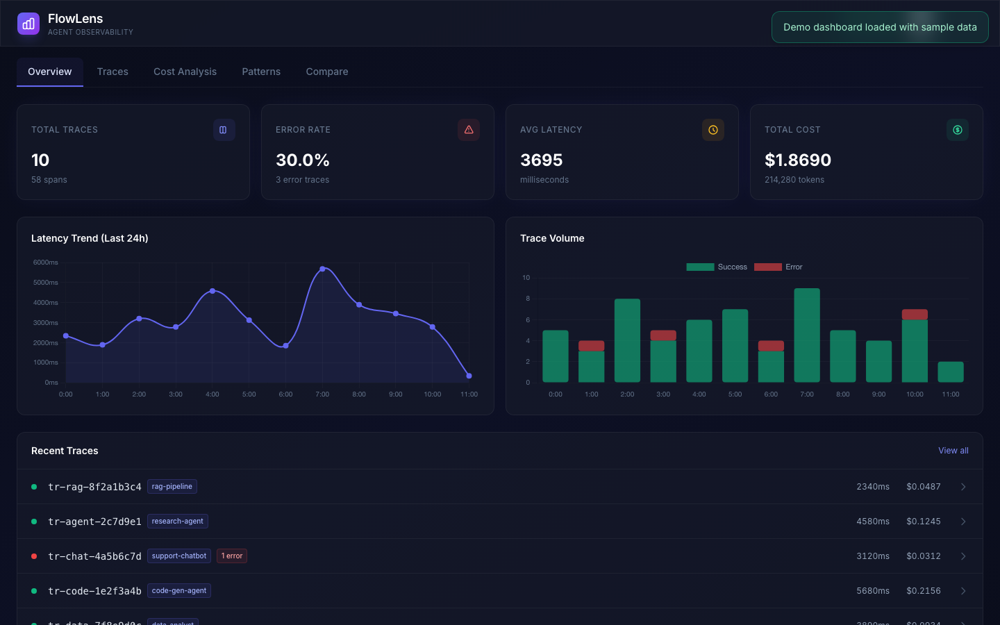
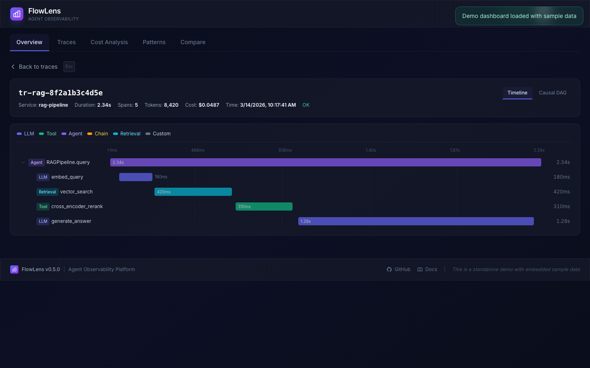
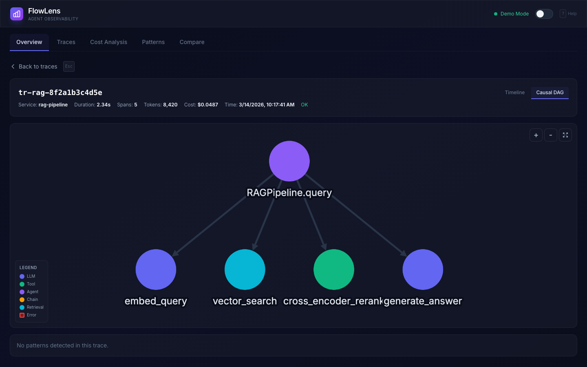

<p align="center">
  <h1 align="center">FlowLens</h1>
  <p align="center"><strong>Agent Observability Platform — trace, analyze, and optimize your LLM agents</strong></p>
</p>

<p align="center">
  <a href="https://pypi.org/project/flowlens/"></a>
  <a href="https://github.com/yusenthebot/flowlens/actions"></a>
  <a href="https://www.python.org/downloads/"></a>
  <a href="https://github.com/yusenthebot/flowlens/blob/main/LICENSE"></a>
  <a href="https://opentelemetry.io/"></a>
</p>

> FlowLens shows you **why** your AI agent failed, not just *that* it failed. It traces every LLM call, tool execution, and decision point — then builds **causal error graphs** to pinpoint root causes instantly.

<p align="center">
  
</p>

> **Try it now:** Open [`examples/demo_dashboard.html`](examples/demo_dashboard.html) in your browser — no install needed.

---

## Features

- **Causal DAG Analysis** — distinguishes root causes from cascaded failures
- **15+ Anti-Pattern Detectors** — retry storms, infinite loops, context overflow, timeout cascades, token waste, cold start penalty, and more
- **Zero-Intrusion Tracing** — decorators instrument any Python agent without touching business logic
- **Auto-Instrumentation** — one call patches Anthropic, OpenAI, and LangChain automatically
- **Plugin System** — extensible plugin registry with entry-point discovery
- **Cost Attribution** — token + cost breakdown by model, tool, or service (16+ models priced)
- **Streaming Support** — accurate token counts for streamed LLM responses
- **Real-Time Dashboard** — FastAPI server with WebSocket live feed, DAG visualization, waterfall timeline
- **CLI Tools** — `flowlens serve`, `export`, `import`, `stats`, `health`, `demo`
- **Multiple Exporters** — Console, HTTP, OTLP, CSV, JSONL, with batch + gzip support

---

## Quick Start

### 1. Install

```bash
pip install flowlens
```

### 2. Instrument

```python
from flowlens import FlowLens, trace_agent, trace_llm, trace_tool

lens = FlowLens(service_name="my-agent", export_to="console")

@trace_agent(name="research_bot")
def run(task):
    result = search(task)
    return summarize(result)

@trace_tool(name="web_search")
def search(query):
    return ["result1", "result2"]

@trace_llm(model="claude-sonnet-4-20250514")
def summarize(data):
    return "Summary of findings..."

run("What is agentic AI?")
```

Console output:

```
[FlowLens] Trace a1b2c3d4... | 3 spans | 142ms | 525 tokens | $0.0026 | OK
```

### 3. Visualize

```bash
flowlens serve                   # dashboard at http://localhost:8585
```

```python
# send traces to the dashboard
lens = FlowLens(service_name="my-agent", export_to="http",
                endpoint="http://localhost:8585/v1/traces/ingest")
```

---

## Dashboard

<p align="center">
  
</p>

<p align="center">
  
</p>

<p align="center">
  
</p>

<p align="center">
  
</p>

**Key views:**
- **Overview** — metrics cards, latency trends, trace volume charts
- **Trace detail** — waterfall timeline with color-coded spans (LLM/Tool/Agent/Chain/Retrieval)
- **Causal DAG** — interactive graph showing error propagation and root causes
- **Cost analysis** — cost breakdown by model and service, cost trends over time
- **Pattern alerts** — automatically detected anti-patterns with severity levels

> Open [`examples/demo_dashboard.html`](examples/demo_dashboard.html) for an interactive preview with 10 embedded sample traces.

---

## Examples

Run any example — no API keys needed (all use simulated data):

```bash
python3 examples/quickstart.py       # basic tracing in 30 seconds
python3 examples/rag_pipeline.py     # full RAG: embed → search → rerank → generate
python3 examples/multi_agent.py      # 4-agent collaboration with retry logic
python3 examples/cost_optimizer.py   # compare 4 model strategies, find savings
python3 examples/live_dashboard.py   # launch dashboard with sample data
```

Or use the CLI / Makefile:

```bash
flowlens demo                        # run quickstart demo
flowlens demo --all                  # run all demos
make demo                           # run all demos via Makefile
```

| Example | What it demonstrates |
|---|---|
| [`quickstart.py`](examples/quickstart.py) | Basic tracing with 4 decorators, colored trace tree output |
| [`rag_pipeline.py`](examples/rag_pipeline.py) | RAG pipeline: embedding, vector search, reranking, generation |
| [`multi_agent.py`](examples/multi_agent.py) | Planner → Researcher → Writer → Reviewer with rejection/retry |
| [`cost_optimizer.py`](examples/cost_optimizer.py) | Compare sonnet+haiku vs opus vs gpt-4o, cost bar charts |
| [`live_dashboard.py`](examples/live_dashboard.py) | Generate traces, start server, open browser to dashboard |
| [`demo_dashboard.html`](examples/demo_dashboard.html) | Standalone interactive dashboard (just open in browser) |

---

## Architecture

```
┌──────────────────────────────────────────────────────────────┐
│                       Your Agent Code                        │
│   @trace_agent  ·  @trace_llm  ·  @trace_tool               │
│   @trace_chain  ·  @trace_retrieval  ·  auto_instrument()    │
└──────────────┬───────────────────────────────────────────────┘
               │
       ┌───────▼───────┐            ┌──────────────────────────┐
       │   SDK Layer    │            │    Analysis Layer         │
       │               │            │                           │
       │ · TraceContext │            │ · Causal DAG Builder      │
       │ · SpanContext  │            │ · 15+ Pattern Detectors   │
       │ · Exporters    │            │ · Root Cause ID           │
       │   Console/CSV  │            │ · Cost Engine             │
       │   HTTP/OTLP    │            │ · Multi-Trace Correlator  │
       │   JSONL/Batch  │            │ · Weekly Reports          │
       │ · Plugins      │            └───────────▲──────────────┘
       └───────┬───────┘                         │
               └────────────────►   ┌────────────┴──────────────┐
                     export         │     Server Layer           │
                                    │                            │
                                    │ · FastAPI REST API (18+)   │
                                    │ · WebSocket live feed      │
                                    │ · SQLite + connection pool │
                                    │ · Interactive Dashboard    │
                                    └────────────────────────────┘
```

---

## Integrations

### Auto-Instrumentation (zero decorators)

```python
from flowlens import FlowLens
from flowlens.sdk.auto_instrument import auto_instrument

lens = FlowLens(service_name="my-agent", export_to="console")
auto_instrument(lens)  # patches Anthropic, OpenAI, LangChain

# your existing code works — traces created automatically
```

### Plugin System

```python
from flowlens.plugins import load_plugin

load_plugin("anthropic")   # or "openai", "langchain"
```

| Framework | What is traced |
|---|---|
| Anthropic | `messages.create`, `messages.stream` |
| OpenAI | `chat.completions.create` (sync/async/streaming) |
| LangChain | Chains, Agents, Tools |

### Decorator-Based (any framework)

```python
@trace_agent(name="my_bot")        # root span, creates the trace
@trace_llm(model="gpt-4o")         # LLM calls — token + cost tracking
@trace_tool(name="search")         # external tools — params + results
@trace_chain(name="pipeline")      # multi-step workflows
@trace_retrieval(name="rag")       # vector search — result count
@trace_embedding(model="ada-002")  # embedding calls — dimensions
```

---

## CLI Reference

```bash
flowlens serve    [--host HOST] [--port PORT] [--db PATH]   # start dashboard server
flowlens analyze  <trace-file.jsonl>                         # analyze trace file
flowlens export   [--format json|csv|jsonl] [--output FILE]  # export traces from DB
flowlens import   <json-file> [--db PATH]                    # import traces
flowlens stats    [--db PATH]                                # show trace statistics
flowlens health   [--db PATH]                                # check server & DB status
flowlens demo     [--all] [--dashboard] [--quick]            # run demo examples
flowlens version                                             # show version
```

---

## Documentation

| Doc | Description |
|---|---|
| [Quickstart Guide](docs/quickstart.md) | Step-by-step getting started |
| [API Reference](docs/api-reference.md) | Complete REST API (18+ endpoints) |
| [Architecture](docs/architecture.md) | Internals and design decisions |
| [Deployment](docs/deployment.md) | Docker, Docker Compose, production setup |
| [Troubleshooting](docs/troubleshooting.md) | Common issues and solutions |

API docs also available at `http://localhost:8585/docs` when the server is running.

---

## How It Compares

|  | Langfuse | LangSmith | Opik | **FlowLens** |
|---|:---:|:---:|:---:|:---:|
| Open Source | Yes | No | Yes | **Yes** |
| **Causal DAG Analysis** | No | No | No | **Yes** |
| **Error Cascade Detection** | No | No | No | **Yes** |
| **Anti-Pattern Detection** | No | No | No | **15+** |
| Auto-Instrumentation | Partial | Yes | No | **Yes** |
| Plugin System | No | No | No | **Yes** |
| Streaming Support | No | Partial | No | **Yes** |
| WebSocket Live Feed | No | No | No | **Yes** |
| Multiple Exporters | 2 | 1 | 1 | **6** |
| CLI Tools | No | Yes | No | **8 commands** |
| Self-Hosted | Docker | No | Docker | **pip + Docker** |

---

## Contributing

Contributions welcome! See [CONTRIBUTING.md](CONTRIBUTING.md) for guidelines.

```bash
git clone https://github.com/yusenthebot/flowlens.git
cd flowlens
pip install -e ".[dev]"
python3 -m pytest tests/ -q   # 754 tests — all must pass
```

---

## License

[MIT](LICENSE) — Copyright (c) 2024-2026 FlowLens Contributors
