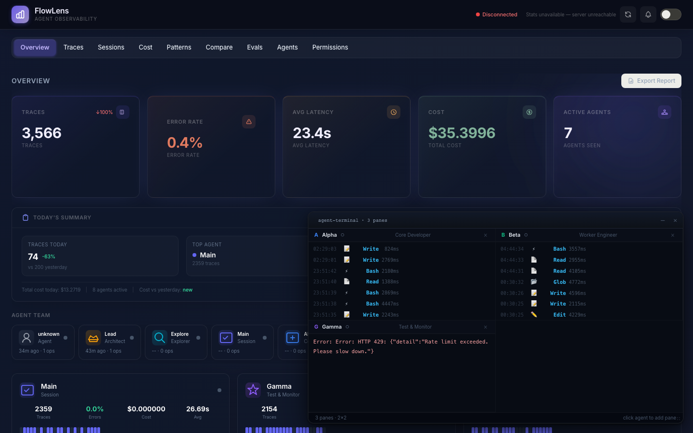
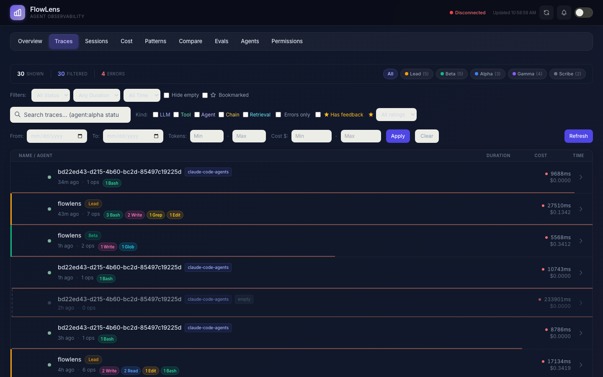
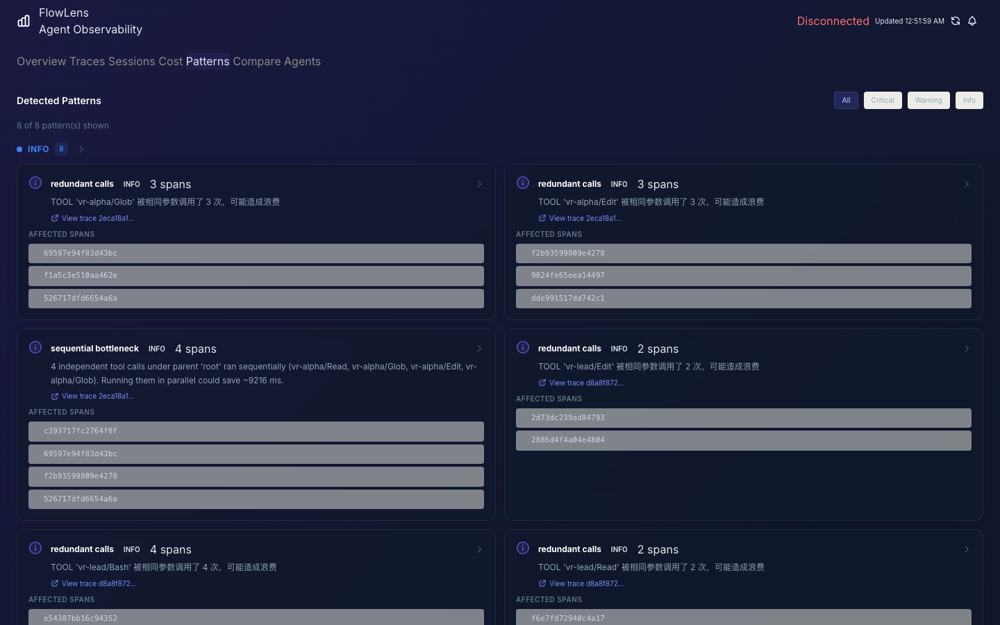
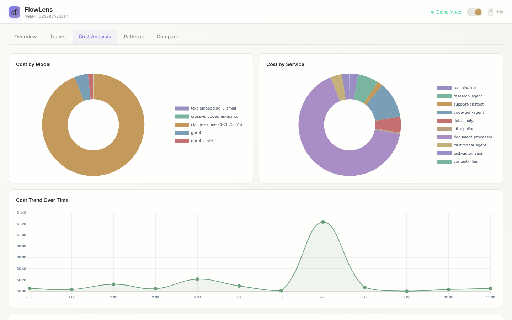
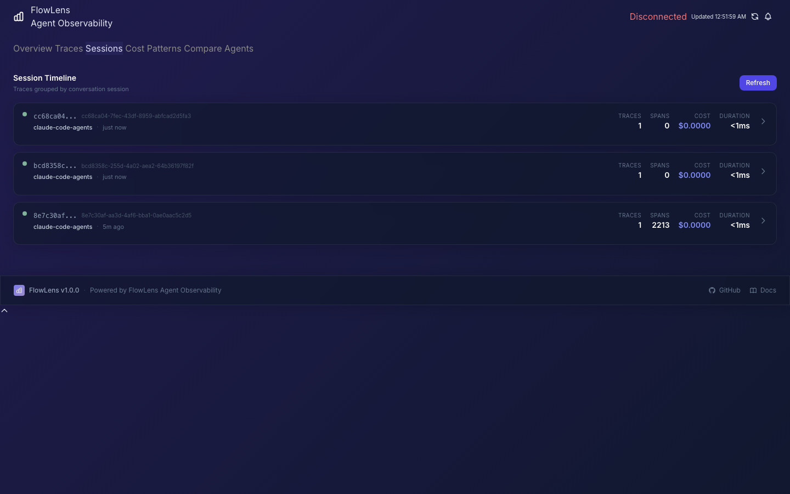
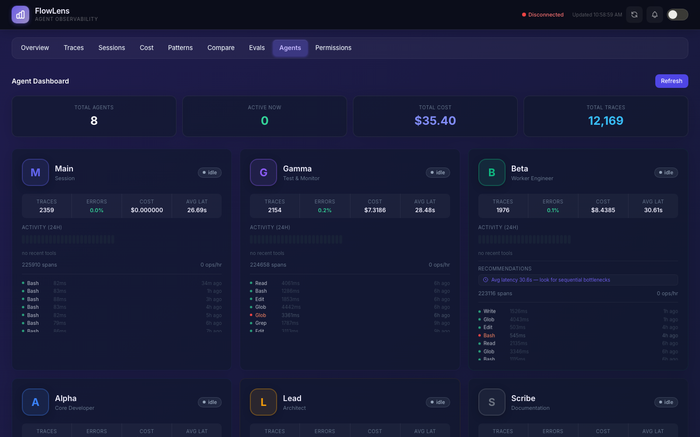

<div align="center">
  
  <h1>FlowLens</h1>
  <p><strong>See what your AI agents are actually doing.</strong></p>
  <p>The observability platform built for LLM agent teams. Think Chrome DevTools, but for your AI.</p>
  <p><strong>看清你的 AI Agent 到底在做什么。</strong></p>
  <p>为 LLM Agent 团队打造的可观测性平台。像 Chrome DevTools，但面向 AI。</p>
</div>

<p align="center">
  <a href="https://pypi.org/project/flowlens/"></a>
  <a href="https://github.com/yusenthebot/flowlens/actions"></a>
  <a href="https://www.python.org/downloads/"></a>
  <a href="https://github.com/yusenthebot/flowlens/blob/main/LICENSE"></a>
  <a href="https://opentelemetry.io/"></a>
</p>

<div align="center">
  
  <br>
  <em>Watch Alpha, Beta, and Gamma work in parallel — every tool call, every file read, every decision.</em>
  <br>
  <em>实时观察 Alpha、Beta、Gamma 并行工作 — 每次工具调用、每次文件读取、每个决策。</em>
</div>

---

Ever had an agent burn through $50 in tokens on a retry loop you didn't know about? Or spent an hour debugging a multi-agent workflow, only to discover the root cause was three services away?

你有没有遇到过 Agent 在你不知道的重试循环中烧掉 $50 的 token？或者花了一小时调试多 Agent 工作流，最后发现根因在三个服务之外？

We built FlowLens because we were tired of flying blind. When you're running AI agent teams, things break in ways that traditional logging can't catch. An agent silently retries 47 times. Context windows overflow. One slow tool call cascades into a full system stall.

我们创建 FlowLens 是因为受够了盲飞。运行 AI Agent 团队时，故障模式超出传统日志的捕获能力 — Agent 悄悄重试 47 次、context window 溢出、一个慢工具调用引发全链路阻塞。

**FlowLens catches all of that in real-time.** It traces every LLM call, tool execution, and decision point — then builds causal error graphs to pinpoint root causes instantly.

**FlowLens 实时捕获这一切。** 追踪每次 LLM 调用、工具执行和决策点 — 然后构建因果错误图，瞬间定位根因。

> **Try it now / 立即体验:** [**Live Interactive Dashboard**](https://yusenthebot.github.io/flowlens/demo_dashboard.html) | [**Product Tour**](https://yusenthebot.github.io/flowlens/demo_autoplay.html) — no install needed / 无需安装

---

## 🚀 Quick Start / 快速开始 — Give This to Your Agent / 交给你的 Agent

Paste this into Claude Code, Cursor, or any AI coding assistant:

把这段话粘贴给 Claude Code、Cursor 或任何 AI 编程助手：

> Set up FlowLens agent observability for this project.
> Install flowlens, add the hook, and start the dashboard.
> Repo: https://github.com/yusenthebot/flowlens

Or do it yourself in 30 seconds / 或者自己 30 秒搞定：

```bash
pip install flowlens
flowlens demo --dashboard
# Open http://localhost:8585 🎉
```

That's it. You'll see a dashboard with sample traces, live agent monitoring, and cost tracking.

就这样。你会看到一个包含示例 trace、实时 Agent 监控和成本追踪的 Dashboard。

---

## What You Get / 你能得到什么

### Real-time Agent Terminal / 实时 Agent 终端
*Like htop for your AI agents / 像 htop，但面向 AI Agent*

<p align="center">
  
</p>

Click any agent to open a tmux-style terminal pane. Watch file reads, bash commands, grep patterns, and LLM calls stream in live. Auto-arranges into a grid when you're monitoring multiple agents. Draggable, resizable, and connected via WebSocket for zero-latency updates.

点击任意 Agent 打开 tmux 风格终端面板。实时观看文件读取、bash 命令、grep 模式和 LLM 调用。监控多个 Agent 时自动排列为网格。可拖拽、可缩放，通过 WebSocket 零延迟更新。

**Why it matters / 为什么重要:** You'll catch a stuck agent in seconds instead of discovering it when the bill arrives. / 几秒内发现卡住的 Agent，而不是等到账单到来。

### Trace Waterfall / 追踪瀑布图
*See exactly where time and money go / 精确看到时间和金钱花在哪里*

<p align="center">
  
</p>

Every trace gets a smart summary — "3 Read, 2 Bash, 1 LLM" — instead of a meaningless UUID. Filter by agent, status, duration, or time window. Click into any trace to see an agent-colored waterfall timeline with inline file paths, commands, and cost breakdowns.

每条 trace 都有智能摘要 — "3 Read, 2 Bash, 1 LLM" — 而不是无意义的 UUID。按 Agent、状态、时长或时间窗口筛选。点击任意 trace 查看按 Agent 着色的瀑布时间线，内联显示文件路径、命令和成本分解。

**Why it matters / 为什么重要:** When a request takes 45 seconds, you'll know exactly which 3-second tool call caused the 42-second cascade. / 请求耗时 45 秒时，你能精确知道是哪个 3 秒的工具调用导致了 42 秒的级联。

### Smart Pattern Detection / 智能模式检测
*12 anti-patterns caught automatically / 自动捕获 12 种反模式*

<p align="center">
  
</p>

FlowLens watches for retry storms, infinite loops, context overflow, timeout cascades, token waste, and more. Each detector has configurable thresholds via environment variables. No rules to write — it just works.

FlowLens 监控重试风暴、无限循环、context 溢出、超时级联、token 浪费等。每个检测器都可通过环境变量配置阈值。无需编写规则 — 开箱即用。

**Why it matters / 为什么重要:** The patterns that burn the most money are the ones you don't know about. / 最烧钱的模式恰恰是你不知道的那些。

### Cost Intelligence / 成本智能
*Know your spend before the bill arrives / 在账单到来前掌握花费*

<p align="center">
  
</p>

Token and cost breakdown by model, tool, or service across 16+ models. Monthly projection with confidence intervals. Budget alerts with compound AND conditions.

按模型、工具或服务分解 token 和成本，支持 16+ 模型。月度预测带置信区间。预算告警支持复合 AND 条件。

**Why it matters / 为什么重要:** "We spent $200 yesterday" is less useful than "Agent-3 is using GPT-4 for tasks that Claude Haiku handles fine." / "昨天花了 $200" 不如 "Agent-3 在用 GPT-4 做 Claude Haiku 就能搞定的任务" 有用。

### Session Timeline / 会话时间线
*Replay any conversation, step by step / 逐步回放任何对话*

<p align="center">
  
</p>

Group traces by session. See the full chronological story — which agents were involved, how long each step took, what failed, and why.

按会话分组 trace。查看完整的时间线 — 哪些 Agent 参与了、每步耗时多久、什么失败了、为什么。

### Agent Network / Agent 网络
*See how your agents collaborate / 查看 Agent 如何协作*

<p align="center">
  
</p>

Every agent gets a unique avatar, color, and dashboard card. See trace counts, error rates, cost, latency, and activity sparklines at a glance. An interactive SVG network shows spawn hierarchies with animated particles.

每个 Agent 都有独特的头像、颜色和仪表盘卡片。一眼看到 trace 数量、错误率、成本、延迟和活动曲线。交互式 SVG 网络展示调用层级关系和动态粒子。

---

## Instrument in 5 Lines / 5 行代码接入

```python
from flowlens import FlowLens, trace_agent, trace_llm, trace_tool

lens = FlowLens(service_name="my-agent", export_to="http")

@trace_agent(name="researcher")
async def research(topic):
    plan = await plan_research(topic)     # Automatically traced / 自动追踪
    docs = await search_knowledge(plan)   # Costs tracked / 成本追踪
    return await synthesize(docs)         # Errors caught / 错误捕获
```

Or skip decorators with auto-instrumentation / 或者用自动插桩跳过装饰器：

```python
from flowlens import FlowLens
from flowlens.sdk.auto_instrument import auto_instrument

lens = FlowLens(service_name="my-agent", export_to="http")
auto_instrument(lens)  # patches Anthropic, OpenAI, LangChain / 自动 patch
```

---

## How It Compares / 竞品对比

|  | Langfuse | LangSmith | Opik | **FlowLens** |
|---|:---:|:---:|:---:|:---:|
| Open Source / 开源 | ✅ | ❌ | ✅ | **✅** |
| Causal DAG Analysis / 因果 DAG 分析 | — | — | — | **✅** |
| Anti-Pattern Detection / 反模式检测 | — | — | — | **15+ configurable** |
| Agent Team Monitoring / Agent 团队监控 | — | Partial | — | **Real-time + terminal** |
| Session Timeline / 会话时间线 | — | — | — | **✅** |
| Cost Forecasting / 成本预测 | — | — | — | **Monthly + CI** |
| Auto-Instrumentation / 自动插桩 | Partial | ✅ | — | **✅** |
| WebSocket Live Feed / 实时推送 | — | — | — | **✅** |
| Self-Hosted / 自托管 | Docker | ❌ | Docker | **pip + Docker** |

---

## Architecture / 架构

```
+------------------------------------------------------------------+
|                         Your Agent Code                          |
|   @trace_agent  .  @trace_llm  .  @trace_tool                   |
+---------------+--------------------------------------------------+
                |
        +-------v--------+            +-----------------------------+
        |   SDK Layer     |            |      Analysis Layer         |
        |   SDK 层        |            |      分析层                  |
        |                 |            |                             |
        | . TraceContext   |            | . Causal DAG Builder        |
        | . Exporters x7   |            | . 15+ Pattern Detectors     |
        | . Auto-Instrument|            | . Cost Engine (16+ models)  |
        | . Plugins        |            | . Budget Alert Engine       |
        +-------+---------+            +-----------^-----------------+
                |                                  |
                +------------------>  +------------+------------------+
                      export          |       Server Layer             |
                                      |       服务层                    |
                                      |                                |
                                      | . FastAPI REST API (25+ routes)|
                                      | . WebSocket live feed          |
                                      | . SQLite + FTS5 full-text      |
                                      | . SVG Dashboard (single-page)  |
                                      +--------------------------------+
```

---

## CLI Reference / CLI 参考

```bash
flowlens serve    [--host HOST] [--port PORT] [--db PATH]    # start dashboard / 启动仪表盘
flowlens analyze  <trace-file.jsonl>                          # analyze traces / 分析 trace
flowlens export   [--format json|csv|jsonl] [--output FILE]   # export from DB / 导出
flowlens import   <json-file> [--db PATH]                     # import traces / 导入
flowlens stats    [--db PATH]                                 # show statistics / 统计
flowlens health   [--db PATH]                                 # health check / 健康检查
flowlens demo     [--all] [--dashboard] [--quick]             # run demos / 运行演示
flowlens version                                              # show version / 版本
```

---

## Examples / 示例

No API keys needed / 无需 API 密钥：

```bash
python3 examples/quickstart.py           # basic tracing / 基础追踪
python3 examples/rag_pipeline.py         # full RAG pipeline / RAG 管道
python3 examples/multi_agent.py          # 4-agent collaboration / 4 Agent 协作
python3 examples/cost_optimizer.py       # compare model costs / 模型成本对比
python3 examples/live_dashboard.py       # launch dashboard / 启动仪表盘
```

| Example / 示例 | Description / 说明 |
|---|---|
| [`quickstart.py`](examples/quickstart.py) | Basic tracing with decorators / 装饰器基础追踪 |
| [`rag_pipeline.py`](examples/rag_pipeline.py) | RAG: embed, search, rerank, generate / RAG 全流程 |
| [`multi_agent.py`](examples/multi_agent.py) | Multi-agent with retry logic / 多 Agent + 重试 |
| [`cost_optimizer.py`](examples/cost_optimizer.py) | Compare model strategies / 模型策略对比 |
| [`demo_dashboard.html`](https://yusenthebot.github.io/flowlens/demo_dashboard.html) | Interactive dashboard (no install) / 交互式仪表盘 |
| [`demo_autoplay.html`](https://yusenthebot.github.io/flowlens/demo_autoplay.html) | Product tour (no install) / 产品导览 |

---

## Documentation / 文档

| Doc / 文档 | Description / 说明 |
|---|---|
| [Quickstart Guide](docs/quickstart.md) | Step-by-step getting started / 快速入门 |
| [API Reference](docs/api-reference.md) | Complete REST API / 完整 API 参考 |
| [Architecture](docs/architecture.md) | Internals and design / 内部架构与设计 |
| [Deployment](docs/deployment.md) | Docker, production setup / Docker 生产部署 |
| [Troubleshooting](docs/troubleshooting.md) | Common issues / 常见问题 |

---

## Contributing / 贡献

Contributions welcome! / 欢迎贡献！See [CONTRIBUTING.md](CONTRIBUTING.md).

```bash
git clone https://github.com/yusenthebot/flowlens.git
cd flowlens
pip install -e ".[dev]"
python3 -m pytest tests/ -q   # 1156 tests
```

---

## Ready to see what your agents are doing? / 准备好看看你的 Agent 在干什么了吗？

```bash
pip install flowlens && flowlens demo --dashboard
```

**Star this repo** if FlowLens saved you from a $50 retry loop. ⭐

如果 FlowLens 帮你避免了一次 $50 的重试循环，**给个 Star** 吧。⭐

---

[MIT](LICENSE) — Copyright (c) 2024-2026 FlowLens Contributors
